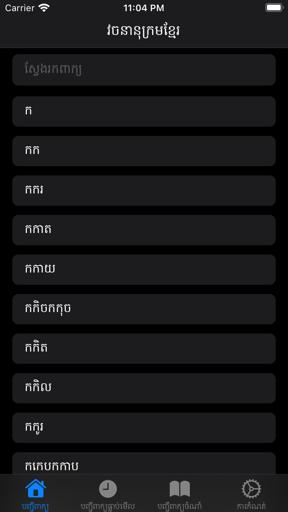
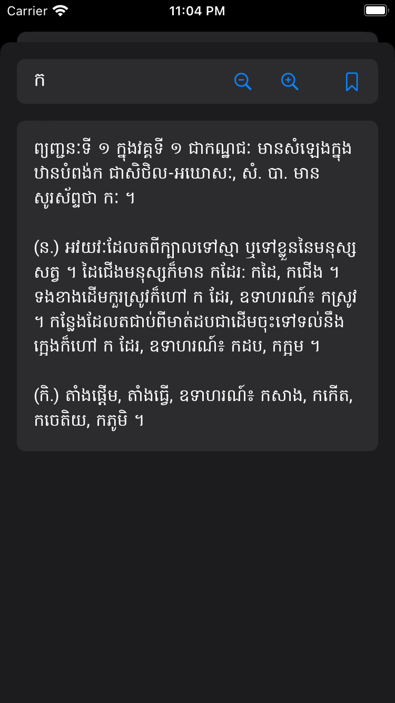
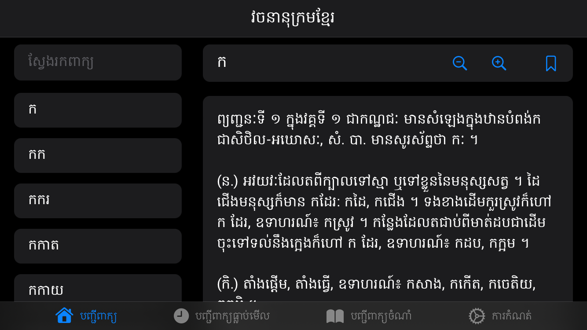

# វចនានុក្រមខ្មែរឌីជីថល (សម្តេចព្រះសង្ឃរាជ ជួន ណាត ជោតញ្ញាណោ)

Digital Khmer Dictionary (Samdech Sangha Rāja Jhotañāno Chuon Nath)

An iOS app written using SwiftUI. I have written this app out of curiosity to learn new things and to understand about iOS app development with SwiftUI.

This app is also available in other programming languages and platform. Check them out below.

[Android](https://github.com/sovathna/Khmer-Dictionary)

[Flutter](https://github.com/sovathna/flutter_dictionary)

[Compose Desktop](https://github.com/sovathna/compose-dictionary)

[UWP](https://github.com/sovathna/UwpDictionary)

# រូបភាព

|បញ្ជីពាក្យ|ពន្យល់ពាក្យ|
|-------|----------|
|||

|បញ្ជីពាក្យ និងពន្យល់ន័យ (ផ្ដេក)|
|--------------------------|
||
